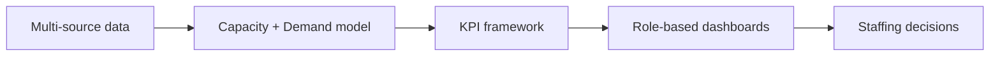

# CapacityLens — Solution Design Document

**See demand. Measure capacity. Plan with confidence.**

| Field | Value |
|-------|-------|
| Solution name | **CapacityLens** |
| Domain | QA Resource Planning, Workforce Analytics & BI |
| Version | 1.0 |
| Status | Solution Design |
| Repository folder | `CapacityLens/` |

This master document consolidates the CapacityLens design. Detailed specifications live under [`docs/`](docs/).

---

## Executive Summary

QA organizations often cannot answer a basic planning question: *Do we have enough capacity for the work we are committing to — this sprint, this month, and this year?* Demand arrives from projects, enhancements, maintenance, production support, and operational initiatives, while capacity data is scattered across Azure DevOps, Jira, Excel, SharePoint, timesheets, and HR systems.

**CapacityLens** is a consolidated Capacity Utilization and Resource Planning solution that:

1. Builds a governed **person-centric capacity model** (gross → deductions → net available).  
2. Maps **estimated and forecasted demand** against that capacity at individual and team levels.  
3. Exposes **KPIs, dashboards, and scenarios** so leaders can hire, reallocate, cross-skill, or reduce bench based on evidence.  
4. Supports **sprint → month → quarter → rolling 12-month** horizons with one consistent math engine.

---

## 1. Business Requirements

**Full detail:** [docs/01-Business-Requirements.md](docs/01-Business-Requirements.md)

### Functional (summary)
- Capacity inventory, demand capture, actuals, calendar/PTO handling  
- Allocation engine with overbook detection  
- Utilization & gap analytics; multi-horizon planning  
- Forecasting, scenario planning, alerts, drill-through, RLS  

### Non-functional (summary)
- Dashboard performance (≤3–5s), daily/near-daily freshness, SSO + RLS  
- Scalability to 200–2,000+ resources, auditability of overrides, ±2% reconciliation  

### Stakeholders
| Group | Needs |
|-------|-------|
| QA Leadership | Org utilization, gaps, hire/bench posture |
| Portfolio PMs | Coverage, multi-project allocation, forecast |
| Team Managers | Sprint/month load, overbooking, skill gaps |
| Workforce Planners | Bench, scenarios, attrition/hiring impact |
| Individuals | Personal allocation & upcoming load |

---

## 2. Data Model Design

**Full detail:** [docs/02-Data-Model-Design.md](docs/02-Data-Model-Design.md) · **Diagrams:** [diagrams/architecture-overview.md](diagrams/architecture-overview.md)

### Architecture
Medallion lakehouse: **Bronze (raw) → Silver (conformed) → Gold (star schema) → Power BI semantic model**, with a parallel **scenario sandbox**.

### Core entities
- Dimensions: Person, Team, Project, Period/Date, Skill, DemandCategory, Scenario  
- Facts: CapacityPeriod, Allocation, Demand, ActualHours, ForecastDemand  
- Bridges: PersonSkill, PersonTeam, Source identity maps  

### Key dependencies
HR roster authority, holiday/PTO feeds, ADO/Jira APIs, templated Excel/SharePoint plans, Entra ID security groups.

---

## 3. Capacity Planning Framework

**Full detail:** [docs/03-Capacity-Planning-Framework.md](docs/03-Capacity-Planning-Framework.md)

### Core math
\[
NetAvailable = Gross - Holidays - Leave - Training - AdminOverhead - OtherNonProject
\]

\[
PlannedUtilization\% = \frac{AllocatedHours}{NetAvailableHours} \times 100
\]

\[
CapacityGap = DemandHours - NetAvailableHours
\]

### Defaults
| Parameter | Default |
|-----------|---------|
| Overhead rate | 10–15% |
| Healthy utilization | 75–90% |
| Soft / hard overbook | 100% / 110% |

### Demand tiers
Committed → Likely → Pipeline×Probability, compared to net capacity and to allocated staffing separately (unstaffed demand vs overbooking are different signals).

---

## 4. KPI Framework

**Full detail:** [docs/04-KPI-Framework.md](docs/04-KPI-Framework.md) · **CSV glossary:** [templates/capacity-kpi-glossary.csv](templates/capacity-kpi-glossary.csv)

| KPI | Formula (short) |
|-----|-----------------|
| Capacity utilization % | Allocated ÷ NetAvailable |
| Allocation % | Hours on project ÷ NetAvailable |
| Available capacity | max(0, Net − Allocated) |
| Over-utilization % | Magnitude/share above band or 100% |
| Under-utilization % | Magnitude/share below band |
| Resource demand forecast | Committed + Likely + Pipeline×Prob |
| Team load balancing index | \(1 - \sigma/\mu\) of member utilization |
| Project staffing coverage | Allocated ÷ Demand |
| Forecasted capacity gap | ForecastDemand − NetAvailable (also FTE) |
| Resource bench % | Available ÷ NetAvailable |

---

## 5. Dashboard and Reporting Design

**Full detail:** [docs/05-Dashboard-and-Reporting.md](docs/05-Dashboard-and-Reporting.md)

| View | Purpose | Signature visuals |
|------|---------|-------------------|
| Executive | Org health & decisions | Scorecards, R12 capacity vs demand, team heatmap |
| Portfolio | Multi-project coverage | Coverage heatmap, demand stack, allocation matrix |
| Team Manager | Actionable load balancing | Resource loading heatmap, sprint waterfall, exceptions |
| Individual | Personal plan transparency | Load timeline, allocation list, PTO deductions |

Drill path: **Exec → Portfolio → Team → Individual → allocation/work item**.

---

## 6. Planning Horizons

**Full detail:** [docs/06-Planning-Horizons.md](docs/06-Planning-Horizons.md)

| Horizon | Focus |
|---------|-------|
| Sprint | Commit vs net capacity; prevent overbook |
| Monthly | Allocation refresh; intake control |
| Quarterly | Gap FTE; hire/reallocate/cross-skill |
| Rolling 12-month | Structural workforce & budget posture |

One engine, multiple `PeriodType` grains; sprint→month reconciliation within ±2%.

---

## 7. Forecasting and Scenario Planning

**Full detail:** [docs/07-Forecasting-and-Scenario-Planning.md](docs/07-Forecasting-and-Scenario-Planning.md)

Stakeholders can sandbox and compare to baseline:

1. **Demand uplift** on projects/portfolios  
2. **Hiring** with start dates and ramp curves  
3. **Attrition** with coverage blast radius  
4. **Project delays** shifting demand windows  
5. **Cross-team rebalance** with skill fit / training derate  

Promotion to baseline is governed (planner + leadership).

---

## 8. Implementation Roadmap

**Full detail:** [docs/08-Implementation-Roadmap.md](docs/08-Implementation-Roadmap.md)

| Phase | Focus | Duration |
|-------|-------|----------|
| 0 Align | KPIs, access, RACI | 2–3 weeks |
| 1 Foundation | Roster, capacity, pilot team BI | 6–8 weeks |
| 2 Demand & Allocation | Projects, coverage, exec MVP | 6–8 weeks |
| 3 Forecast & Horizons | R12, alerts, My Capacity | 4–6 weeks |
| 4 Scenarios & Scale | What-if, skills, org rollout | 4–6 weeks |
| 5 Optimize | Accuracy, automation, cost overlays | Ongoing |

**Stack:** Microsoft Fabric / ADF + Lakehouse + Power BI Apps + Entra ID RLS + Excel/SharePoint/Power Apps for planning intake.

**Top risks:** poor estimates, stale spreadsheets, identity mismatches, low adoption — mitigated via DQ gates, system-of-record rules, pilot-first rollout, and cadence embedding.

---

## 9. Sample Dashboard Layout

**Full detail:** [docs/09-Sample-Dashboard-Wireframes.md](docs/09-Sample-Dashboard-Wireframes.md)

Team Manager Cockpit (primary wireframe) includes:

- Global filters + refresh/DQ trust bar  
- Five KPI scorecards  
- Person × week utilization heatmap  
- Sprint capacity vs demand waterfall  
- Person × project allocation matrix  
- Exceptions list and skill gap bars  
- Drill to Individual view and Portfolio coverage  

---

## Document Index

| # | Document |
|---|----------|
| 1 | [Business Requirements](docs/01-Business-Requirements.md) |
| 2 | [Data Model Design](docs/02-Data-Model-Design.md) |
| 3 | [Capacity Planning Framework](docs/03-Capacity-Planning-Framework.md) |
| 4 | [KPI Framework](docs/04-KPI-Framework.md) |
| 5 | [Dashboard and Reporting](docs/05-Dashboard-and-Reporting.md) |
| 6 | [Planning Horizons](docs/06-Planning-Horizons.md) |
| 7 | [Forecasting and Scenario Planning](docs/07-Forecasting-and-Scenario-Planning.md) |
| 8 | [Implementation Roadmap](docs/08-Implementation-Roadmap.md) |
| 9 | [Sample Dashboard Wireframes](docs/09-Sample-Dashboard-Wireframes.md) |

---

## Next Steps

1. Run **Phase 0** workshop: confirm utilization bands, demand taxonomy, and pilot teams.  
2. Stand up Fabric/ADLS workspace and Person Hub from HR.  
3. Publish Team Manager MVP and validate capacity math against known sprint.  
4. Expand to allocations, portfolio coverage, and R12 forecast.  

---

*CapacityLens — designed for QA organizations that need a single, forward-looking lens on capacity versus demand.*
