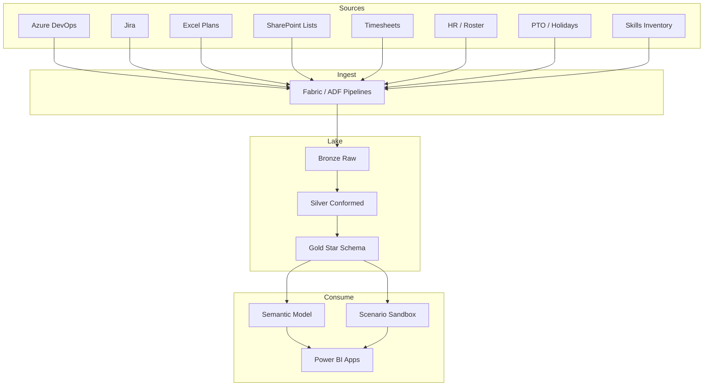
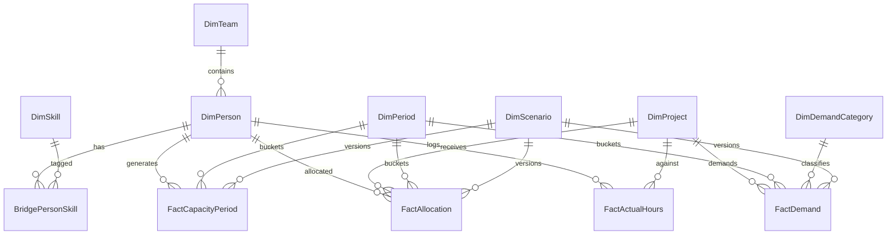
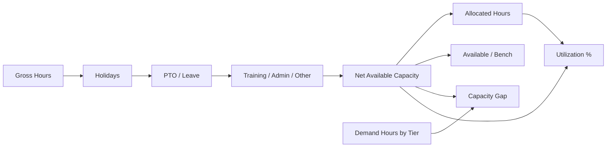
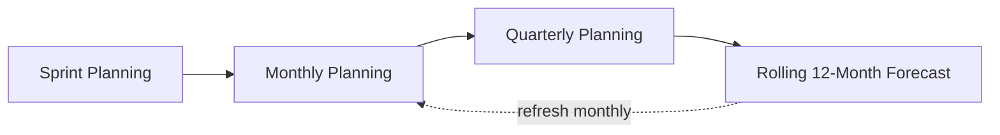

# CapacityLens — Architecture & Entity Diagrams

## End-to-End Architecture

```mermaid
flowchart TB
  subgraph Sources
    ADO[Azure DevOps]
    Jira[Jira]
    XL[Excel Plans]
    SP[SharePoint Lists]
    TS[Timesheets]
    HR[HR / Roster]
    PTO[PTO / Holidays]
    SK[Skills Inventory]
  end

  subgraph Ingest
    ADF[Fabric / ADF Pipelines]
  end

  subgraph Lake
    BRZ[Bronze Raw]
    SLV[Silver Conformed]
    GLD[Gold Star Schema]
  end

  subgraph Consume
    SM[Semantic Model]
    SC[Scenario Sandbox]
    PBI[Power BI Apps]
  end

  ADO --> ADF
  Jira --> ADF
  XL --> ADF
  SP --> ADF
  TS --> ADF
  HR --> ADF
  PTO --> ADF
  SK --> ADF
  ADF --> BRZ --> SLV --> GLD
  GLD --> SM --> PBI
  GLD --> SC --> PBI
```

## Logical Entity Relationships

```mermaid
erDiagram
  DimTeam ||--o{ DimPerson : contains
  DimPerson ||--o{ BridgePersonSkill : has
  DimSkill ||--o{ BridgePersonSkill : tagged
  DimPerson ||--o{ FactCapacityPeriod : generates
  DimPeriod ||--o{ FactCapacityPeriod : buckets
  DimPerson ||--o{ FactAllocation : allocated
  DimProject ||--o{ FactAllocation : receives
  DimPeriod ||--o{ FactAllocation : buckets
  DimProject ||--o{ FactDemand : demands
  DimPeriod ||--o{ FactDemand : buckets
  DimDemandCategory ||--o{ FactDemand : classifies
  DimPerson ||--o{ FactActualHours : logs
  DimProject ||--o{ FactActualHours : against
  DimScenario ||--o{ FactCapacityPeriod : versions
  DimScenario ||--o{ FactAllocation : versions
  DimScenario ||--o{ FactDemand : versions
```

## Demand vs Capacity Flow

```mermaid
flowchart LR
  G[Gross Hours] --> D1[Holidays]
  D1 --> D2[PTO / Leave]
  D2 --> D3[Training / Admin / Other]
  D3 --> N[Net Available Capacity]
  N --> A[Allocated Hours]
  N --> V[Available / Bench]
  DEM[Demand Hours by Tier] --> GAP[Capacity Gap]
  N --> GAP
  A --> U[Utilization %]
  N --> U
```

## Planning Horizons

```mermaid
flowchart LR
  S[Sprint Planning] --> M[Monthly Planning]
  M --> Q[Quarterly Planning]
  Q --> R[Rolling 12-Month Forecast]
  R -.refresh monthly.-> M
```
